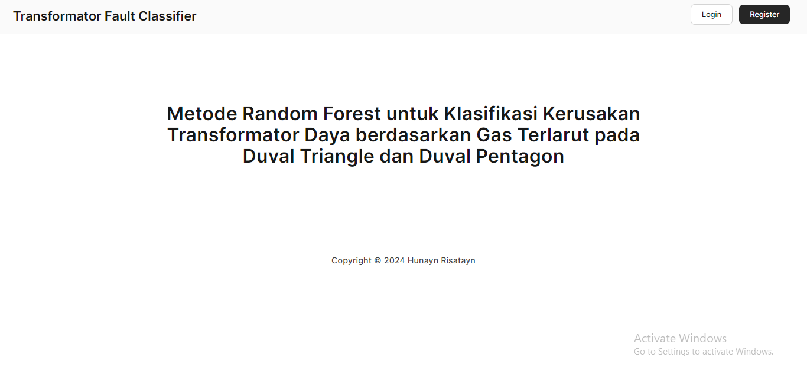

# Sistem Informasi Klasifikasi Kerusakan Tranformator Daya

Aplikasi yang dikembangkan untuk memudahkan proses pengelompokan abnormalitas yang terjadi pada transformator daya. Seiring dengan pengoperasian transformator dihasilkan kontaminan berupa partikel gas akibat pemanasan, inkonsistensi tegangan maupun pengaruh lingkungan. Gas yang terbentuk dapat menurunkan performa transformator sehingga diperlukan pengamatan terhadap konsentrasi gas. Sistem menerima input berupa konsentrasi gas yang akan menghasilkan jenis kerusakan yang terjadi pada transformator daya

  

## Perancangan Sistem dan Pembentukan Database

Uraian berbagai tindakan yang dapat difasilitasi oleh sistem tercermin dalam bentuk diagram berikut. Terdapat satu tipe user yang bertindak sebagai admin untuk melakukan proses klasifikasi dan seluruh elemen yang mendukung mekanisme sistem

  

Data yang dihasilkan untuk setiap kegiatan klasifikasi oleh sistem tersimpan dalam tabel yang saling terhubung dalam bagan dibawah ini

  

## Fitur Sistem

-   #### Konstruksi Model dan Training Dataset

Fitur ini berfungsi sebagai dasar pembangunan model Random Forest dari data training berdasarkan letak koordinat yang diolah menggunakan acuan dataset

 

-   #### Klasifikasi Kerusakan Transformator Daya

Fitur ini untuk memberikan layanan kepada user terhadap sistem ketika terdapat data konsentrasi gas terlarut baru yang akan dipetakan kedalam label/kelas tujuan

  
 

-   #### Tingkat Akurasi Model

Fitur ini untuk memberikan layanan kepada user terhadap sistem ketika terdapat data konsentrasi gas terlarut baru yang akan dipetakan kedalam label/kelas tujuan

 

-   #### History Klasifikasi

Fitur ini untuk memberikan layanan kepada user terhadap sistem ketika terdapat data konsentrasi gas terlarut baru yang akan dipetakan kedalam label/kelas tujuan

 

## Kesimpulan

Pembentukan Sistem Informasi Klasifikasi Kerusakan Tranformator Daya difungsikan untuk menunjang proses penggolongan disfungsi transformator daya. User berperan sebagai admin untuk melakukan seluruh entitas dalam proses klasifikasi. Modifikasi terkait kebutuhan klasifikasi kerusakan transformator daya dengan waktu proses yang lebih singkat dan analisis yang lebih simple dan ringan terwujud dalam bentuk pembangunan program

